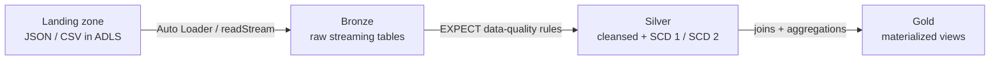

# Databricks Lakehouse Demos — Structured Streaming, Auto Loader & Delta Live Tables


End-to-end Databricks data-engineering demos covering the three core ingestion and transformation patterns, all built on the **Bronze → Silver → Gold** medallion architecture with Delta Lake and Unity Catalog.

> Built by **Madhushree Reddy** as a hands-on showcase of production-style Databricks pipelines.
> <!-- Add your LinkedIn URL here, e.g. [LinkedIn](https://www.linkedin.com/in/your-handle) -->

## What this demonstrates

- **Delta Live Tables (DLT)** declarative pipelines: streaming ingest, data-quality `EXPECT` constraints, and change data capture (SCD Type 1 and Type 2).
- **Spark Structured Streaming**: micro-batch JSON → Delta with checkpointing.
- **Auto Loader** (`cloudFiles`): cloud-optimized incremental file ingestion with schema evolution.
- **Unity Catalog** governance: external locations, volumes, catalogs, and schemas.

## Architecture



## Projects

| # | Project | Pattern | Key techniques |
|---|---|---|---|
| 1 | [`DLT_Demo_Project`](./DLT_Demo_Project) | Delta Live Tables (SQL) | `cloud_files()` bronze ingest, `EXPECT` constraints, `APPLY CHANGES INTO` (SCD 1 and 2), `explode`, gold materialized view |
| 2 | [`gizmobox_structured_streaming`](./gizmobox_structured_streaming) | Spark Structured Streaming (PySpark) | `readStream` / `writeStream`, schema inference, 10-second micro-batch trigger, checkpointing |
| 3 | [`gizmobox_autoloader_structured_streaming`](./gizmobox_autoloader_structured_streaming) | Auto Loader (PySpark) | `cloudFiles`, persisted `schemaLocation`, schema evolution via `schemaHints`, checkpointed Delta writes |

## Tech stack

Databricks · PySpark · Spark Structured Streaming · Delta Lake · Delta Live Tables · Unity Catalog · Azure Data Lake Storage (ADLS Gen2)

## Datasets and catalogs

These demos use two synthetic e-commerce datasets, each in its own Unity Catalog:

- **`circuitbox`** — the Delta Live Tables project (customers, orders, addresses).
- **`gizmobox`** — the Structured Streaming and Auto Loader projects (customer records).

Sample data lives in each project's `Data/` folder. The setup notebooks register the external location, catalogs, schemas, and volumes in Unity Catalog before the pipelines run.

## Running the demos

1. A Databricks workspace with **Unity Catalog** and access to cloud storage (ADLS Gen2, S3, or GCS).
2. Run each project's **setup notebook** once to create the catalog, schemas, and volumes.
3. **DLT:** deploy `DLT_Demo_Project/2_DLT_Demo/transformations/*.sql` as a Delta Live Tables pipeline in continuous mode.
4. **Streaming / Auto Loader:** run the notebooks on a cluster (or serverless) and land files in the volume to watch incremental processing.

## Deploy with Databricks Asset Bundles

The Delta Live Tables pipeline is defined as code in [`databricks.yml`](./databricks.yml) using **Databricks Asset Bundles**, so it deploys reproducibly instead of being clicked together in the UI:

```bash
# set your workspace host in databricks.yml, then:
databricks bundle validate          # check the config
databricks bundle deploy -t dev     # create/update the pipeline in your workspace
databricks bundle run dlt_demo      # trigger a pipeline update
```

The bundle declares the pipeline's catalog, target schema, compute (serverless), and source files, and ships `dev` and `prod` targets so the same definition deploys to either environment.

## Repository structure

```
Databricks_Demo/
├── DLT_Demo_Project/                          # Delta Live Tables (bronze/silver/gold, SCD 1 and 2)
│   ├── 1_DLT_Demo_Project_Setup.ipynb         # Unity Catalog + storage setup
│   ├── 2_DLT_Demo/transformations/            # bronze.sql, silver.sql, gold.sql
│   └── Data/                                   # sample customers, orders, addresses
├── gizmobox_structured_streaming/             # Spark Structured Streaming (JSON → Delta)
├── gizmobox_autoloader_structured_streaming/  # Auto Loader incremental ingestion
└── README.md
```

## License

Released under the MIT License — see [LICENSE](./LICENSE).
